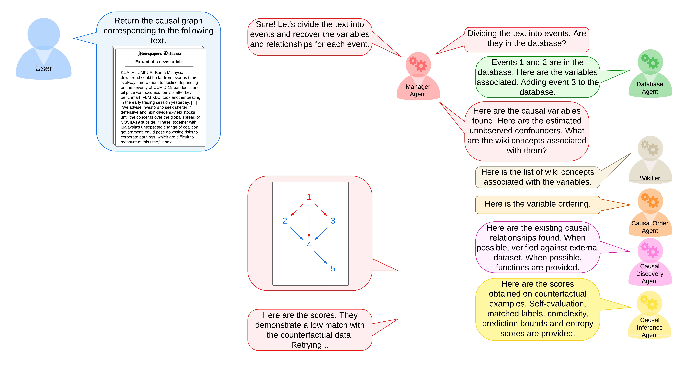

# A Causal World Modelling Agent





## Introduction

Repository for the Causal World Modelling Agent project. This framework is an LLM-based approach for the extraction of causal graphs from natural language text and composition of causal world models. The approach builds a causal model and verifies its consistency across counterfactual scenarios built from multiples sources.


## Installation


```bash
python -m venv env
source env/bin/activate
pip install -r requirements.txt
```

On Windows, use `env\Scripts\activate` instead of `source env/bin/activate`.

A subscription to an LLM API provider may be required.


## Usage

TODO

For now, you can run the `smolagents_notebook.ipynb` Jupyter notebook available at [src/smolagents_notebook.ipynb](src/smolagents_notebook.ipynb).

<!-- ## Messages


### Standard Messages

Agents communicate via messages. A message is a dictionary with the following keys:
```python
{
    "role": "role_name", # The role of the agent that sends the message. Can be 'user' or 'assistant'.
    "content": "content",
}
```
This structure follows the messages syntax from the [OpenAI API](https://platform.openai.com/docs/guides/text-generation).


### Tool Calls

A tool call is a message that is sent to a tool. The message is a dictionary with the following keys:
```python
{
    "type": "function",
    "function": {
        "name": "tool_name",
        "description": "A description of the tool."
        "parameters": {
            "type": "object",
            "properties": {
                "parameter_name_1": {
                    "type": "type",
                    "description": "A description of the parameter."
                }
                "parameter_name_N": {
                    "type": "type",
                    "description": "A description of the parameter."
                }
            }
        }
    }
}
```
This structure follows the tools syntax from the [OpenAI API](https://platform.openai.com/docs/assistants/tools/function-calling). -->


## License

This project is licensed under the MIT License - see the [LICENSE](LICENSE) file for details.


## Acknowledgments


